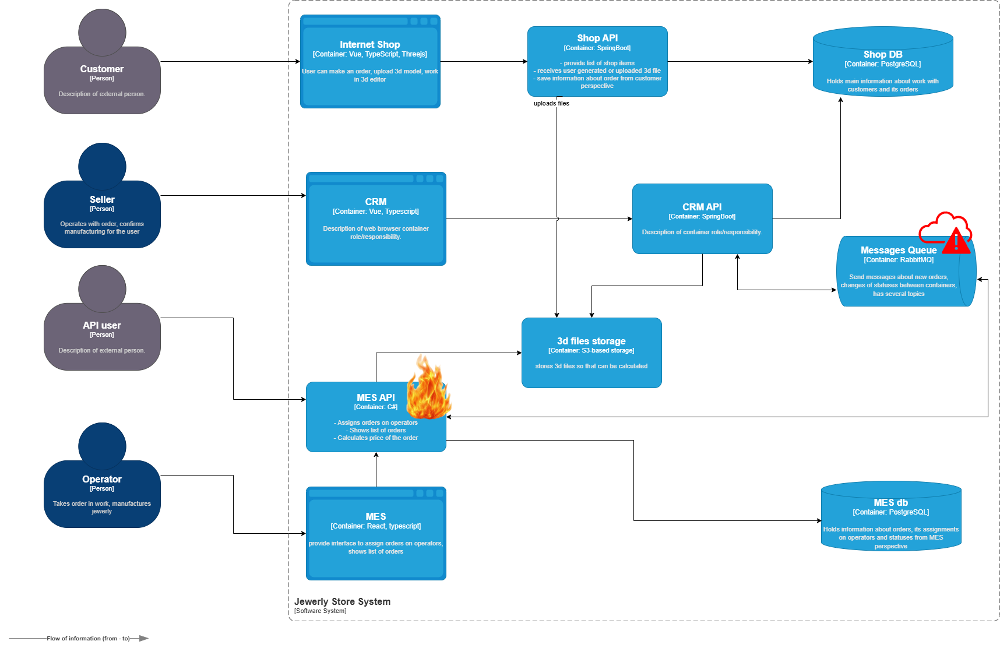
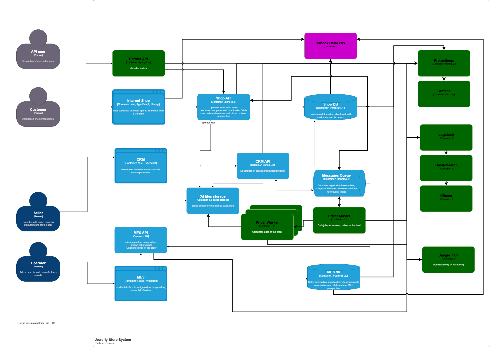

# Планирование: анализ, идентификация проблем и поиск решений

## Текущее решение

Live cycle заказа:

1. INITIATED
1. FILE_UPLOADED
1. SUBMITTED
1. PRICE_CALCULATED
1. MANUFACTURING_APPROVED
1. MANUFACTURING_STARTED
1. MANUFACTURING_COMPLETED
1. PACKAGING
1. SHIPPED
1. CLOSED

## Проблемы бизнеса

Клиенты жалуются менеджерам по продажам, что они не получили заказ и над их изделием работают уже несколько месяцев, хотя обещали закончить за три недели. Жалоб от клиентов на просроченные заказы стало ещё больше после открытия API.

Участились жалобы от операторов: когда они заходят на первую страницу MES, система долго прогружается. Представители компаний ежедневно сообщают, что не получили свои заказы.

## Причина проблем

Перегрузка backend-сервиса MES API, потому что у него слишком много обязанностей: просчет цены, создание заказов для подрядчиков, управление производственным процессом. Исходя из описания, что MES API производит просчет в зависимости от количества полигонов, происходит CPU Bound нагрузка, что торомозит всю систему.

Потенциальный источник проблем — потеря сообщений между системами. Возможно, случаются повторные расчеты моделей.

Также в текущем решении отсуствует централизованное логирование, что усложняет или делает вовсе невозможным поиск и исследование проблем с заказами или системой. 
Отсуствие трейсинга также затрудняет оказание немедленной поддержки и увеличивает сроки решения проблем. 
Отсуствие мониторинга увеличивает репутационные и косвенные риски из-за отказа оборудования и долгой реакции на инциденты.

## Решение

Вынести API партнёров в отдельный микросервис, который будет обращаться к Shop API. В Shop API установить rate-limiter на запросы просчета цены, чтобы предотвратить DDoS через создание заказов.

Убрать функционал просчета цены для 3D модели из MES API, перенеся его в отдельный StateLess микросервис Pricer Worker, который будет брать задачи на просчет из очереди и в асинхронном режиме выполнять расчет. Создать к этому микросервису управляющий сервис-балансировщик Pricer Master, который будет забирать задание из очереди и раздавать задачи воркерам, и будет публиковать в очередь сообщения для обновления цены.

Подключить Shop API к очереди сообщений для асинхронного взаимодействия между Pricer Master, CRM API, MES API.

Чтобы определиться с приоритетами, необходимо ввести систему мониторинга, трассировки и логирования.

## Инициативы

0. Поднять логирование и провести анализ логов для определения дальнейших приоритетов. Выяснить, кто шлёт запросов на рассчет больше: покупатели или партнёры, проверить наличие повторных рассчетов одной и той же модели.
1. Создать отдельный сервис для просчета цены (Pricer Master + Worker)
1. Вынести API для партнёров в отдельный сервис, работающий с Shop API
1. Подключить мониторинг и трассировку
1. Подключить Shop API к брокеру сообщений
1. Поместить базы в кластер Patroni
1. Перевести инфраструктуру в Kubernetes
1. К Pricer добавить Service Discovery, и настроить автоматическое развёртывание экземпляров при повышении нагрузки.

## Комментарий к решению

Если бы была возможность выбрать только 3 инициативы, то это были бы логирование, создание вынесение просчета цены в отдельный сервис, и создание отдельного API для партнёров. Главная задача — разгрузить MES, чтобы операторы быстрее разбирали заказы и не простаивали без работы, так как если система загружена просчетами, то операторы не могут приступить к работе.

Логирование ввожу первым делом, а не мониторинг потому что логирование можно ввести быстрее, экспортируя файлы логов, которые и так скорее всего пишутся. Для полноценных метрик нужно лезть в код, а принять решение по приоритетам можно проанализировав логи из кибаны. Плюс сразу будет инструмент для оперативного поиска проблем.
