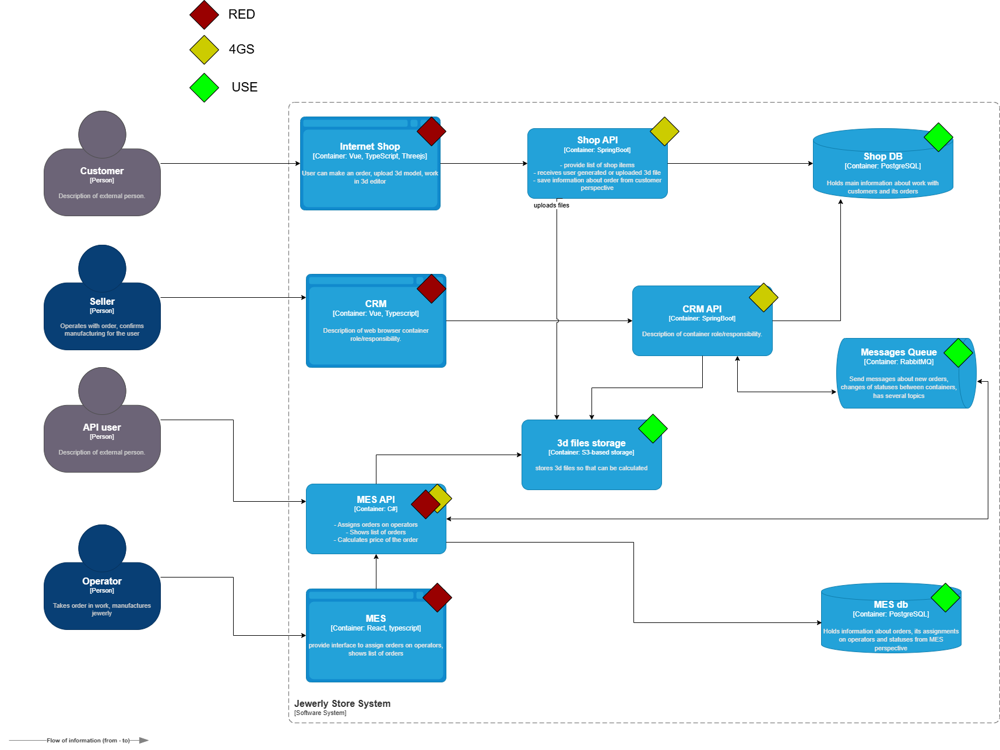
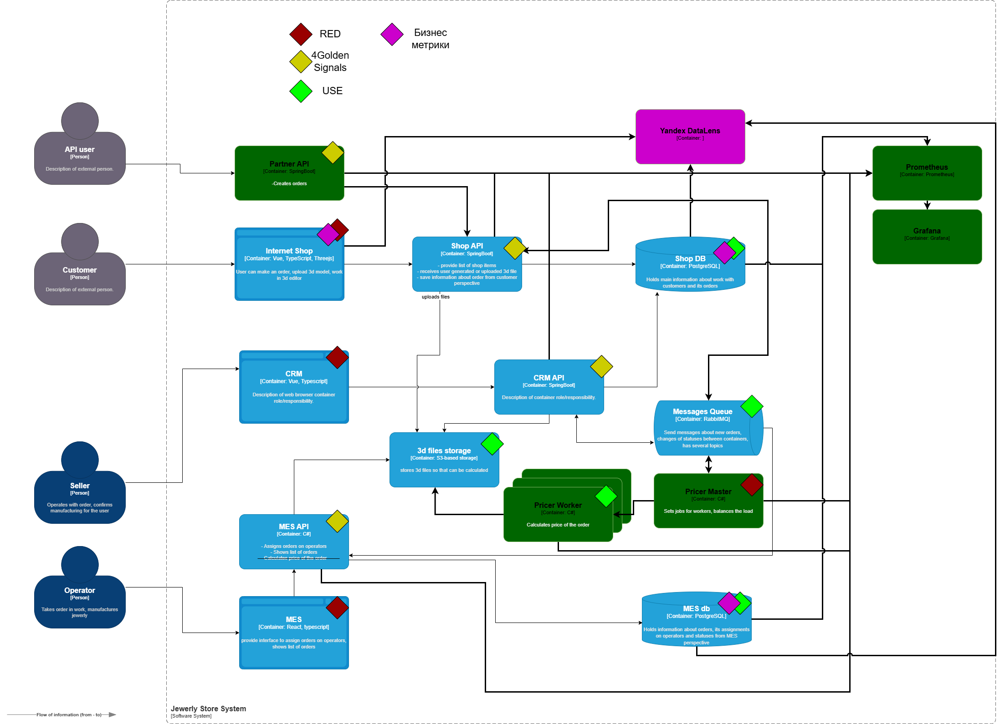

# Выбор и настройка мониторинга в системе

## Текущее решение

## Целевое решение

## Мотивация для мониторинга

В процессе улучшения системы одна за другой закрываются проблемы производительности и функцианальности, процесс должен быть целенаправленный и осознанный. Чтобы этого добиться, нужно ввести мониторинг. Введение дополнительных метрик мониторинга позволит бизнесу увидеть "бутылочные горлышки" системы. Подобно тому, как прочность цепи равняется прочности самого слабого звена, самый проблемный сервис будет ограничивать потенциал всей системы.
Мониторинг позволит решать проблемы точечно и по одной за раз. В деньгах это будет значить, что при решении точечной проблемы, например, производительность базы данных, система сможет без доработок в других местах обслуживать большее количество заказов, соответственно принести больше денег без затрат на улучшение остальных частей системы. 
Чтобы обнаружить такие "лакомые" места, необходимо ввести мониторинг.

Подобно технической части, "бутылочные горлышки" могут образовываться и в бизнес процессах. Для их обнаружения в систему нужно добавить сбор бизнес метритк для последующего бизнес-анализа. Это позволит планировать изменение процессов бизнеса и обаруживать проблемные места вне рамок технической части. Однако решение бизнес задач может привести к увеличению числа пользователей системы, и чтобы неожиданно не упереться в технические проблемы, сначала нужно настроить мониторинг в самой системе.

| Метрика | Зачем нужна | Ярлыки (labels) |
|---------|-------------|-----------------|
| **Number of dead-letter-exchange letters in RabbitMQ** | Мониторинг проблем обработки сообщений. Рост указывает на ошибки в потребителях или некорректные сообщения. | `queue`, `vhost`, `reason` (если доступно) |
| **Number of message in flight in RabbitMQ** | Оценка загруженности очередей и эффективности работы потребителей. Высокое значение может указывать на узкие места. | `queue`, `vhost` |
| **Number of requests (RPS) for [shop/CRM/MES] API** | Понимание нагрузки на сервисы. Основной индикатор трафика. | `service` (shop/crm/mes), `endpoint` (опционально, если агрегировано) |
| **CPU % for [shop/CRM/MES] API** | Мониторинг утилизации вычислительных ресурсов инстансами приложений. Помогает в масштабировании. | `service`, `instance`, `pod` (в k8s) |
| **Memory Utilisation for [shop/CRM/MES] API** | Контроль использования памяти процессами. Предотвращение утечек и OOM Kill. | `service`, `instance`, `pod` (в k8s) |
| **Memory Utilisation for [shop/MES] db instance** | Контроль использования памяти СУБД. Критично для стабильности баз данных. | `db_instance`, `db_type` |
| **Number of connections for [shop/MES] db instance** | Мониторинг нагрузки на БД и лимитов подключений. Помогает выявлять аномалии и утечки соединений. | `db_instance`, `db_type`, `state` (active/idle) |
| **Response time (latency) for [shop/CRM/MES] API** | Измерение производительности с точки зрения пользователя. Ключевая метрика SLA/SLO. | `service`, `endpoint`, `method`, `status_code` |
| **Size of S3 storage** | Контроль использования объектного хранилища для планирования затрат. | `bucket`, `storage_class` |
| **Size of [shop/MES] db instance** | Мониторинг роста объема данных для планирования емкости. | `db_instance` |
| **Number of HTTP 5xx for [shop/CRM/MES] API** | Количество ошибок сервера. Прямой индикатор проблем в сервисах. | `service`, `endpoint`, `method`, `error_type` (500/502/503) |
| **Number of simultaneous sessions for [shop/CRM/MES] API** | Оценка текущей активной пользовательской нагрузки на систему. | `service`, `user_type` (опционально) |
| **Kb transferred (received/sent) for [shop/CRM/MES] API** | Мониторинг сетевого трафика. Помогает в выявлении аномалий и планировании пропускной способности. | `service`, `direction` (in/out) |

**Дополнительные рекомендуемые метрики:**
| Метрика | Зачем нужна | Ярлыки (labels) |
|---------|-------------|-----------------|
| **Number of HTTP 4xx for [shop/CRM/MES] API** | Мониторинг клиентских ошибок (неверные запросы, проблемы авторизации). | `service`, `endpoint`, `method`, `status_code` (401/403/404/422) |
| **Database query latency (p95, p99)** | Глубокий мониторинг производительности самых важных или медленных запросов. | `db_instance`, `query_type` или `query_hash` |
| **RabbitMQ queue length** | Размер очереди. Прямой индикатор отставания потребителей. | `queue`, `vhost` |
| **Disk I/O utilization for DB instances** | Загрузка дисковых подсистем БД. Критично для производительности. | `db_instance`, `device` |
| **Cache (Redis/Memcached) hit ratio** | Эффективность использования кэша. Низкий показатель снижает производительность. | `cache_instance`, `cache_type` |
| **JVM Heap usage (для Java-сервисов)** | Детальный мониторинг памяти Java-приложений для настройки GC. | `service`, `instance`, `memory_pool` |
| **Runtime (CLR) GC (Сборка мусора):** | Время в GC, частота коллекций (особенно Gen 0, 1, 2). | `service`, `instance`, `gc` |
| **Runtime (CLR) Bytes in all Heaps** | Потребление Heap памяти, Bytes in all Heaps | `service`, `instance`, `memory_pool` |
| **Runtime (CLR) Thread Pool (Пул потоков)** | Количество потоков, Thread Pool Queue Length | `service`, `instance`, `thread_pool` |
| **Business-specific metric (e.g., orders_created)** | Отслеживание ключевых бизнес-процессов. Связь DevOps и бизнеса. | `service`, `order_type` (пример) |
| **Node/VM system metrics (disk space, load avg)** | Здоровье инфраструктуры, на которой работают приложения. | `instance`, `mountpoint` (для диска) |

**Примечания:**
1.  **Number of requests per user** — потенциально содержит PII (личные данные). Вместо этого лучше использовать гистограмму/распределение RPS по условным группам пользователей (например, `user_tier`) или агрегированную метрику с отсечением выбросов.
2.  **HTTP 200** — как правило, менее информативна, чем общий RPS или rate всех запросов. Часто достаточно отслеживать общее количество запросов и ошибки (4xx/5xx).
3.  **Повтор метрики "Number of HTTP 500 for shop API"** в списке — дубликат.
4.  **Для метрик API** (RPS, Latency, Errors) крайне полезно добавлять label `endpoint` (или `handler`) для возможности детализации до уровня конкретного пути API. Однако это может увеличить кардинальность метрик. Рекомендуется делать это выборочно для ключевых или проблемных эндпоинтов, либо использовать отдельную метрику с агрегацией по сервису для общего дашборда.

## План действий по введению метрик в сервис просчета стоимости

Предлагаю такой план действий исходя из логики, что система будет переписываться под целевую, то есть речь пройдет в контексте перехода к целевой системе, а не в контексте доработок текущей ситемы.

1. Создать сервис расчета стоимости модели на .net 8, за основу взять исходный код из MES
1. Создать мастер-сервис, который будет управлять заданиями для сервисов рассчетов.
1. Поднять инстанс Prometheus и Kibana
1. Настроить экспортёр Prometheus в сервисе рассчета 
1. Включить в него метрики: CPU %,  Kb transferred (received/sent), Heap usage, GC, Bytei in all Heaps, Thread Pool, количество обрабатываемых полигонов, Время просчета цены, цена.
1. Настроить экспортёр Prometheus в мастер сервисе
1. Включить в него метрики: Количесво заданий в час, скорость рассчета, заданий в очереди, максимальное время ожидания работы в очереди
1. Настроить Dashboards в Grafana
1. Настроить алёртинг при заполнении очереди заданий на мастер-сервисе больше 25, при привышении 15 задач в очереди настроить автоматическое развёртывание еще одного инстанса. 
1. Настроить автоматическое удаление инстансов при очереди меньше 2. Задача создать плотный поток задач на просчет, чтобы в очереди всегда была пара заданий и просчет шел неприрывно.
1. Настроить алёртинг при "зависании" задания больше чем на 35 минут.

## Примечание по бизнес метрикам

Сбор конкретных метрик - это уже задача бизнес аналитики, но стехнической точки зрения главная задача - организовать безопасный доступ к данным. На предлагаемой целевой схеме BI инструмент напрямую ходит в бд, собирает нужные метрики, однако в идеале метрики обезличенно складывать в DWH систему, для обеспечения сохранности конфиденциальных данных.

