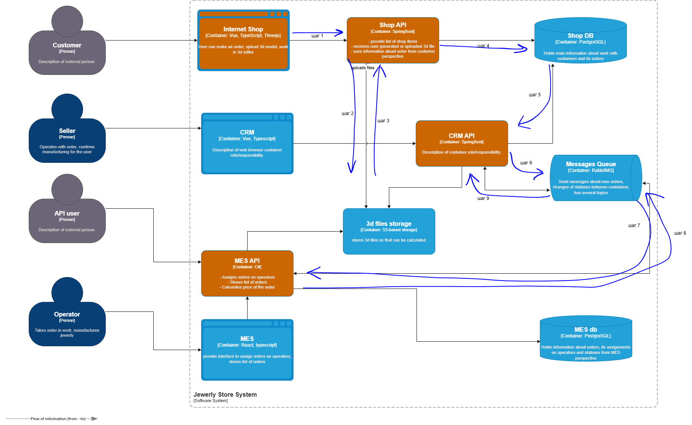
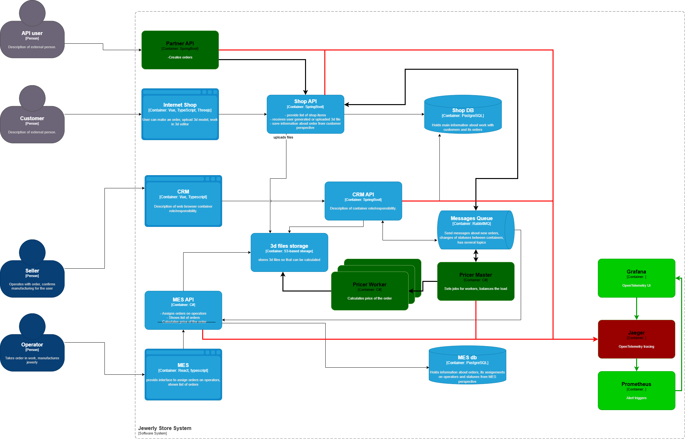

# Архитектурное решение по трейсингу

## Текущее решение

На схеме выделены оранжевым цветом системы, в которых необходимо ввести трейсинг. Синими стрелками изображен путь заказа в системе.
Наиболее вероятной точкой "зависания" заказа является шаг 7, когда MES API  вычитывает сообщения из очереди. Так как сервис перегружен он может долго не вычитывать сообщения, или после вычитки долго не отправлять acknowledge и соединение отвалится по тайм-ауту. Также нет никакой информации о том, какие гарантии доставки предоставляет развёрнутый инстанс rabbitmq. Сообщение может потеряться, если очередь "упадет" во время получения сообщения.

## Мотивация

Трейсинг позволит упростить отслеживание пути запросов, для того, чтобы быстро найти где запрос застрял или оборвался. Это позволит при первой жалобе клиента проверить достоверность проблемы, а так же выбрать меры по устранению причины проблем.

## Предлагаемое решение

Добавить экспорт телеметрии с помощью OpenTelemetry в Jaeger и визуализировать с помощью инструмента Grafana.
Из Jaeger настроить экспорт метрик в Prometheus для того, чтобы настроить алёртинг при потере сообщений.

## Компромисы

Трейсинг не подойдет, если требуется его внедрить срочно (в рамках недели). При любой реализации, нужно будет делать изменения в коде.
В качестве альтернативы трейсингу OpenTelemetry можно использовать Correlation ID - поле, которое будет добавлено во все контракты, и будет заполняться в отправителе. В таком случае можно будет по нему отфильтровать логи приложений, если настроено логирование сообщений хотя бы в файл, и отследить уже усю цепочку вызовов.

Трейсинг неполучится внедрить, если нет доступа на изменение к исходному коду приложения. Если используется проприетарная система, то можно запросить у вендора такой функционал, но это бывает или невозможно, или дорого.

## Безопасность

Передача любых данных в трейсинге должна производиться по шифрованному каналу (SSL, TLS). Из трассеровки должны исключаться конфиденциальные данные, а доступ к UI должен быть возможен только во внутреннем контуре. Jaeger UI не имеет авторизации по умолчанию, однако в случае необходимости, можно перед ui поставить revers proxy, который будет пропускать к нужному адресу только авторизованных пользователей. Если инфраструктура будет развёрнута в Kubernetes, то можно добавть oauth2-proxy в качестве side-car или настроить авторизацию через Ingress, которые будут брать авторизацию на себя. 

В качестве альтернативы можно в качестве ui использовать Grafana, подключив к ней Jaeger как источник данных.

Для доступа к телеметрии предлагается создать отдельную роль "Поддержка" и выдавать её тем сотрудникам, кто занимается расследованием инцидента.

