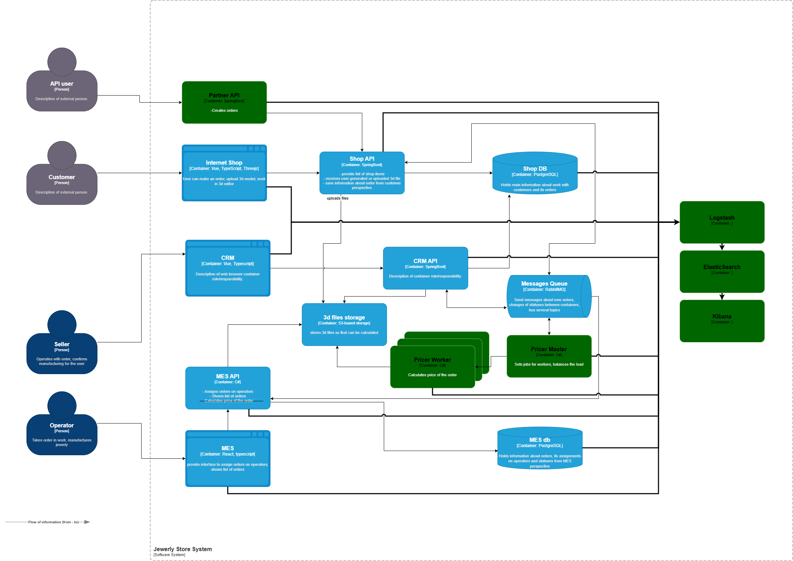

# Архитектурное решение по логированию
## Целевое решение

### Системы для сбора логов

Для эффективного планирования логирования в распределенной микросервисной архитектуре, представленной на C4-диаграмме, необходимо использовать централизованную систему сбора логов (в примере использую ELK Stack) и единый формат логов (например, JSON) с обязательным включением идентификаторов корреляции (Trace ID/Request ID/CorrelationID) для отслеживания запросов между сервисами. 

Сбор логов уровня `INFO` и выше требуется **от всех программных контейнеров** (Internet Shop, CRM, Shop API, CRM API, Messages Queue, MES API, MES, а так же из баз данных) и систем хранения данных для мониторинга.

### Примеры логов уровня INFO

Уровень `INFO` используется для ключевых бизнес-событий и штатной работы:

| Событие | Сервис(ы) | Пример данных лога |
| :--- | :--- | :--- |
| Запуск сервиса | Все API/приложения | `service_started`, `version`, `service_name` |
| Входящий запрос | Все API | `request_received`, `method`, `url`, `trace_id` |
| Создание заказа | Shop API | `order_created`, `order_id`, `user_id`, `amount` |
| Изменение статуса | CRM API / MES API | `order_status_updated`, `order_id`, `new_status` |
| Загрузка файла | Shop API | `file_uploaded`, `file_id`, `user_id` |
| Отправка сообщения | Shop API / MES API | `message_sent`, `message_id`, `queue_name` |

### Использование других уровней

*   `DEBUG`: Детальная трассировка выполнения для отладки.
*   `WARN`: Потенциальные проблемы, не влияющие на работу (например, недоступность второстепенного сервиса).
*   `ERROR`: Критические ошибки, нарушающие выполнение запроса или функции (например, ошибка БД).
*   `FATAL` (`CRITICAL`): Сбой, приводящий к остановке всего приложения.

## Мотивация 

Внедрение комплексной системы логирования и трейсинга является критически важным шагом для обеспечения **надежности**, **прозрачности** и **эффективности** работы всего программного комплекса.

**Почему это нужно компании:**

*   **Быстрое устранение неисправностей (MTTR):** Логирование позволяет оперативно находить первопричины ошибок, сокращая время простоя системы.
*   **Мониторинг бизнес-процессов:** Позволяет отслеживать ключевые события (например, создание заказа, оплата), гарантируя их успешное выполнение.
*   **Обеспечение качества и безопасности:** Помогает выявлять аномалии, попытки несанкционированного доступа и узкие места в производительности.

**Метрики, на которые повлияет внедрение:**

1.  **Бизнес-метрика — Среднее время восстановления (MTTR)** 
1.  **Бизнес-метрика — Уровень успешности заказов** 
1.  **Техническая метрика — Доступность сервисов (SLA/uptime)** 
1.  **Техническая метрика — Производительность/Задержка (Latency)** 

### Приоритезация систем для внедрения

В первую очередь логирование и трейсинг необходимо внедрять в системах, которые находятся на критическом пути выполнения основного бизнес-процесса создания и обработки заказа:

1.  **Shop API** 
1.  **Shop DB и Messages Queue** 
1.  **MES API и MES db** 

## Предлагаемое решение

1. Для сбора и хранения логов будет использоваться ELK Stack. Для каждого сервиса нужно добавить Filebeat, в приложениях создать структуру данных, которая будет отвечать за логирование. Настроить обязательное заполнение корреляционного лога (выбрасывать ошибку, если не заполнен).
1. Развернуть Logstash, ElasticSearch, Kibana
1. Настроить авторизацию для UI компонентов, только для роли "Поддержка" и выдать её разработчикам, которые будут отвечать за это.
1. Выпустить регламент по работе с логами, указав в нём, что нельзя логировать конфиденциальные данные.
1. Организовать хранение логов: ежедневная архивация, перемещение архивов на медленные носители (hdd хранилище), организовать удаление архивов с возрастом больше 6 месяцев.

## Анализ логов

1. Настроить алёртинг при падении бизнес метрик до нуля
1. Настроить создание тикета поддержки при 500 статусах
1. Установить триггеры при всплеске обращений с разных аккаунтов
1. Уставноить триггеры, при которых с одного аккаунта/ip/user agent идет более 30% всех запросов

## Выбор стека 

| Критерий | ELK (Elastic Stack) | OpenSearch | Splunk | Grafana Loki |
| :--- | :--- | :--- | :--- | :--- |
| **1. Лицензия и стоимость** | **Elastic License / SSPL.** Ограничения на коммерческое использование. Платные функции (безопасность, ML) в подписке. | **Apache 2.0.** Полностью открытое и свободное решение. Нет скрытых коммерческих модулей. | **Проприетарная.** Очень высокая стоимость, зависящая от объема индексируемых данных в день. | **Apache 2.0 (Loki), AGPLv3 (Grafana).** Открытый стек, Grafana Enterprise — платная версия с поддержкой. |
| **2. Простота развертывания и поддержки** | **Средняя.** Сложная начальная настройка и тюнинг для эффективной работы. Высокие требования к ресурсам (оперативная память). | **Средняя.** Наследует сложность Elasticsearch, но упрощает некоторые аспекты (например, безопасность по умолчанию). | **Высокая (облако) / Средняя (on-prem).** SaaS-решение максимально просто, on-prem установка требует ресурсов и экспертизы. | **Высокая.** Архитектура "лёгковесна". Проще в установке и требует меньше ресурсов, чем Elasticsearch-подобные системы. |
| **3. Производительность и масштабируемость** | **Очень высокая.** Оптимизирован для полнотекстового поиска и сложных агрегаций. Отлично масштабируется горизонтально. | **Очень высокая.** Форк Elasticsearch, сохраняет все сильные стороны производительности и масштабируемости. | **Высокая.** Проверенная временем, надежная платформа для больших объемов данных. Оптимизированное хранение. | **Высокая (для сценариев логирования).** Использует объектные хранилища (S3), эффективно сжимает данные. Менее гибок для сложного поиска по содержимому полей. |
| **4. Экосистема и интеграции** | **Очень широкая.** Beats, Logstash, огромное количество готовых коннекторов, Kibana с богатыми визуализациями. Де-факто стандарт. | **Растущая.** Имеет собственный Dashboards (форк Kibana), поддерживает многие Beats/Logstash коннекторы. Активно развивается сообществом. | **Очень широкая.** Огромный рынок готовых приложений (Apps) и аддонов для любых систем. Сильная поддержка коммерческих продуктов. | **Хорошая.** Тесно интегрирован в стек Grafana (единая панель для логов, метрик, трейсов). Меньше готовых parsing-правил, но простота добавления своих. |
| **5. Безопасность и управление доступом** | **Продвинутая (в платной версии X-Pack).** RBAC, шифрование, аудит. В бесплатной базовой версии — ограничено. | **Открытая и включена по умолчанию.** Плагины безопасности, RBAC, аудит и шифрование доступны из коробки бесплатно. | **Очень сильная.** Глубокая интеграция с корпоративными системами безопасности (Active Directory, SAML), шифрование данных. | **Базовая.** Основные функции аутентификации и авторизации через Grafana. Для сложных корпоративных сценариев может потребоваться Grafana Enterprise. |
| **6. Использование (Основной кейс)** | **Универсальный поиск и аналитика.** Сложные запросы, полнотекстовый поиск, анализ структурированных и неструктурированных данных. | **Универсальный поиск и аналитика (open-source альтернатива).** Полная замена ELK без лицензионных ограничений. | **Корпоративная безопасность (SIEM) и оперативная аналитика.** Мониторинг ИТ-инфраструктуры, расследование инцидентов. | **Мониторинг и отладка в DevOps-среде.** Просмотр логов рядом с метриками, поиск по меткам времени и labels, а не по содержимому. |
| **Рекомендация для проекта** | **Нейтрально.** Мощно, но лицензионные риски и сложность могут быть избыточны. | **Предпочтительный выбор.** Сохраняет всю мощь Elasticsearch, но полностью открыт и безопасен "из коробки". Идеально для самостоятельного развертывания. | **Не рекомендуется для стартапа.** Неоправданно высокая стоимость для нового проекта. | **Сильный кандидат.** Простота, низкая стоимость владения и интеграция с Grafana для единого observability-стека очень привлекательны. |