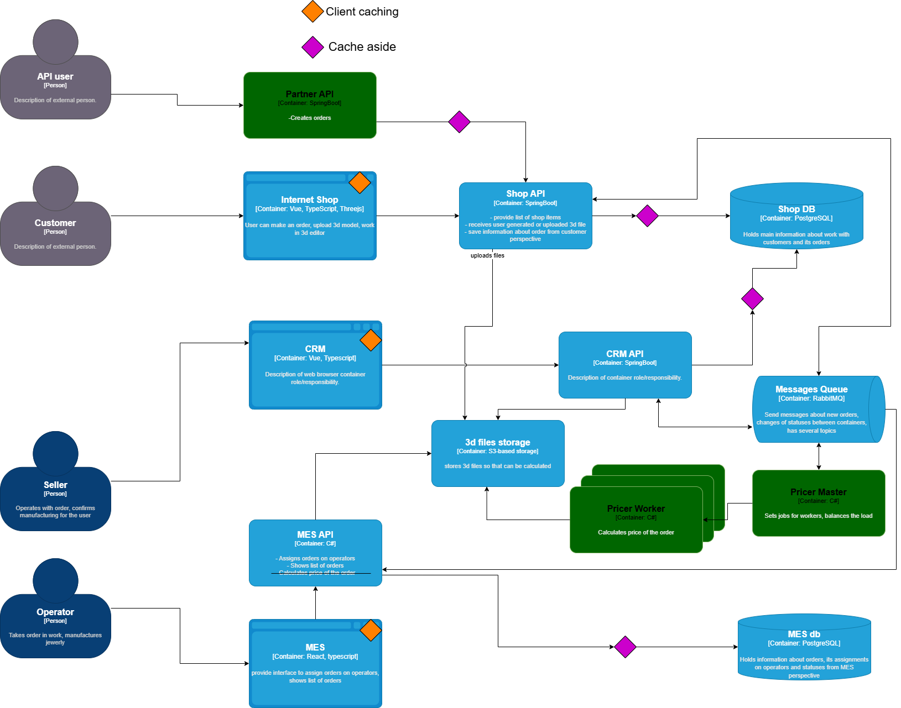
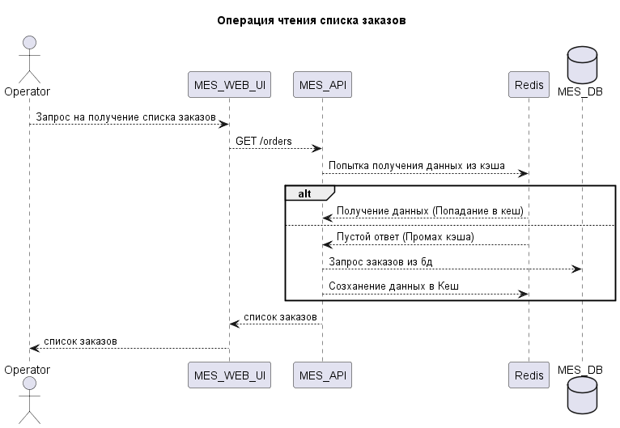
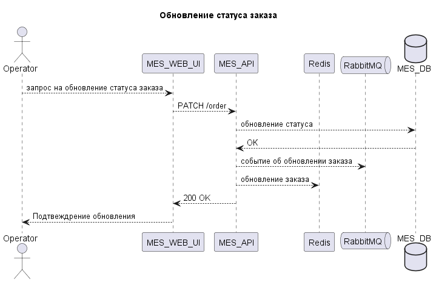

# Архитектурное решение по кешированию
## Целевое решение

Кеширование будет иметь смысл после того, как из текущего решения будет вынесена логика просчета из MES API, так как это является ключевым проблемным местом.
Для ускорения загрузки ui элементов введём кеширование на стороне пользователя, чтобы статические файлы кешировались в браузере пользователя.

Cache Aside будет находиться между API сервивами и БД. В кэш будут лежать не все данные, а выборочно. Например, описание товаров изделий, настройки/сессии пользователей.
Кеширования между хранилищем моделей не будет, потому что размер файлов может быть большим и это израсходует всю оперативную память довольно быстро.

## Мотивация

Внедрение клиентского кеширования ускорит отзывчивость системы, обеспечив более приятный user experience для пользователей. У продавцов, покупателей, операторов будет быстрее загружаться интерфейс.

Наибольший выигрыш в скорости производства бизнес получит если внедрить кеширование в MES. Это ускорит работу с системой 

## Предлагаемое решение

Клиентское кеширование - скрипты, шрифты, иконки.
Серверное кеширование с комбинацией временной и программной инвалидации.
Паттерн серверного кеширования: **Cache-Aside**.

### Почему Cache-Aside:
*   Прост в реализации и не требует изменения логики основной бизнес-логики чтения/записи данных.
*   При чтении данных приложение сначала проверяет кеш, а затем, если данных нет, обращается к БД и записывает результат в кеш.
*   При записи/изменении данных (например, при смене статуса заказа) приложение обновляет БД, а затем инвалидирует или обновляет кеш. Это обеспечивает актуальность данных.

### Почему не подойдут другие паттерны:
*   **Write-Through:** Требует одновременной записи в кеш и БД, что увеличивает задержку записи и усложняет архитектуру.
*   **Refresh-Ahead:** Сложно реализуется и не всегда эффективен, так как требует прогнозирования запросов.

